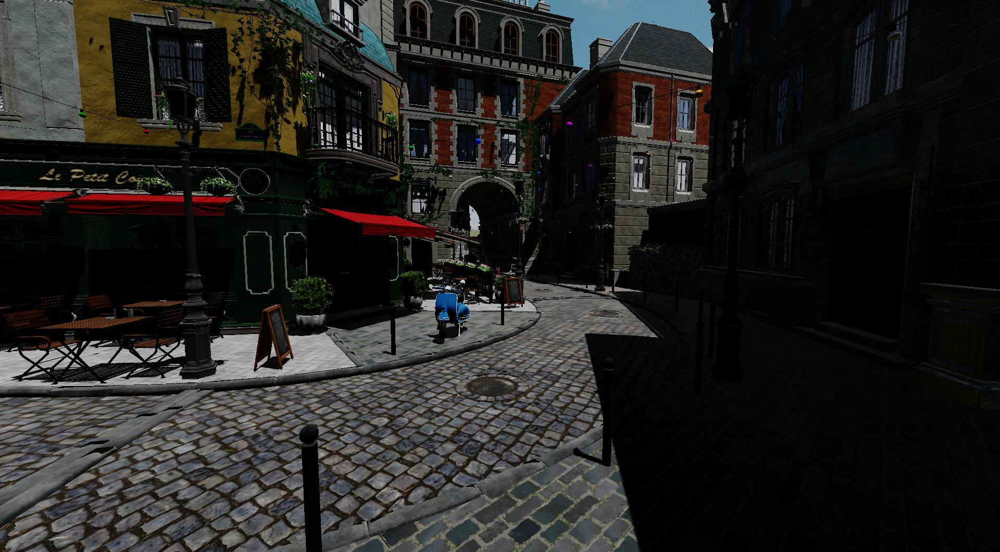

# Oni : a DirectX 12 renderer written in C++

Oni is a modern graphics engine written in C++ with the DirectX 12 API. Its goal is to showcase the latest advancements in real-time rendering.
Oni makes heavy use of compute shaders to accelerate the rendering pipeline -- everything that isn't a draw call is done through compute.

## Requirements

- [xmake](https://xmake.io/#/)
- Windows SDK Latest
- Visual Studio 2022 + ATL Toolkit
- HLSL Shader Model 6.6
- GPU with, ideally, the following features:
    - DXR
    - Mesh shaders
    - Work graphs

## Screenshots

 

## Features

- Deferred rendering
- Shadow mapping
- Bloom
- HDR rendering
- Color grading
- TAA (Temporal Anti-Aliasing)
- Film Grain
- Debug renderer (lines, motion vector visualizer)
- PBR and emissive material workflow
- Point, directional lights

## Other features
- UI powered by ImGui
- In-engine screenshot system
- Shader hot reloading, 

## Dependencies

- [D3D12MA](https://gpuopen.com/d3d12-memory-allocator/)
- [glm](https://github.com/g-truc/glm)
- [ImGui](https://github.com/ocornut/ImGui)
- [ImGuizmo](https://github.com/CedricGuillemet/ImGuizmo)
- [nvtt](https://github.com/castano/nvidia-texture-tools)
- [optick](https://github.com/bombomby/optick)
- [stb](https://github.com/nothings/stb)
- [Agility SDK](https://devblogs.microsoft.com/directx/directx12agility/)
- [cgltf](https://github.com/jkuhlmann/cgltf)
