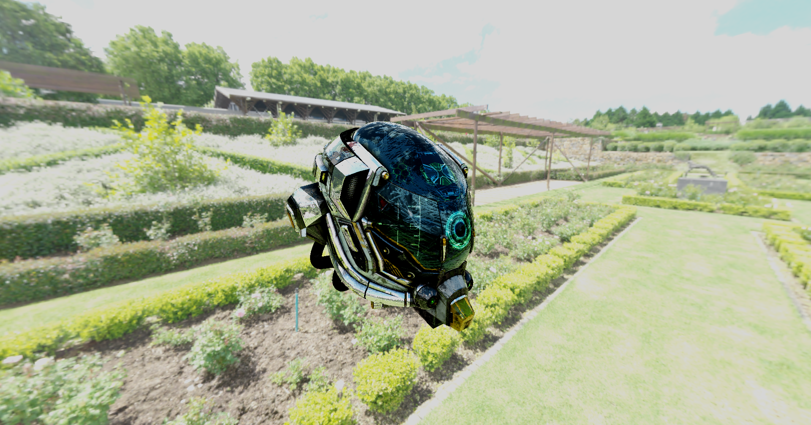

# Oni : D3D12 research renderer and playground

Oni is an experimental sandbox renderer written in C++ with D3D12. It's purpose is for it to be used as a portfolio piece once I go back to job finding.

## Authors

- Amélie Heinrich (amelie.heinrich.dev@gmail.com)

## Requirements

- [xmake](https://xmake.io/#/)
- Windows SDK Latest
- Visual Studio 2022 + ATL Toolkit
- GPU with the following features:
    - DXR
    - Mesh shaders
    - Work graphs

## Building

- xmake
- Copy the contents of the bin folder in build/windows/x64/{debug/release}/
- Copy the D3D12 folder in build/windows/x64/{debug/release}/
- xmake run
- That's it!

## Features:

### Techniques

- Forward shading
- PBR lighting model
- Blinn Phong lighting model
- IBL
- Normal, PBR, emissive, AO textures
- Skybox renderer
- Point, directional lights

### Post Processing
- Color correction (can be tuned)
- Tonemapping

### Misc
- Resource inspector
- Screenshot system
- Mipmap generation through compute
- Simple scene editor to add/move lights around

## WIP:

- Texture compression
- Shadow mapping

## Screenshots

### Physically Based Rendering - IBL

| Damaged Helmet | Bistro | Sponza |
|---|---|---|
|  |  |  |

### Color correction

| Off | On |
|---|---|
|  |  |

### UI (as of 9/14/2024)

## Third party dependencies

- [D3D12MA](https://gpuopen.com/d3d12-memory-allocator/)
- [glm](https://github.com/g-truc/glm)
- [ImGui](https://github.com/ocornut/ImGui)
- [ImGuizmo](https://github.com/CedricGuillemet/ImGuizmo)
- [nvtt](https://github.com/castano/nvidia-texture-tools)
- [optick](https://github.com/bombomby/optick)
- [stb](https://github.com/nothings/stb)
- [Agility SDK](https://devblogs.microsoft.com/directx/directx12agility/)
- [Assimp](https://github.com/assimp/assimp)
